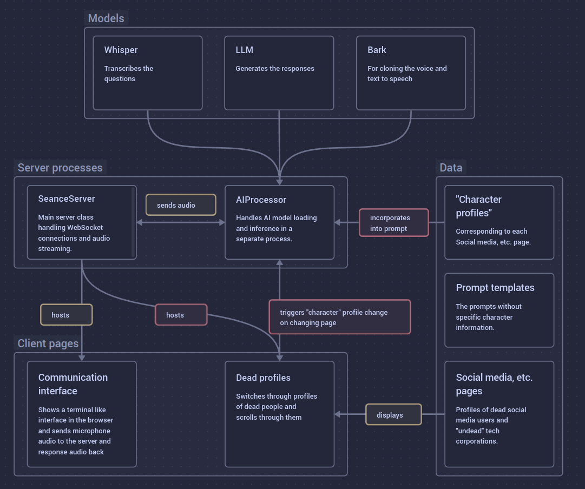

# Expired User Session

Software for post-internet transcommunication (i.e. communication with the spirits of dead users). This current version is a further development for channeling dead and undead entities from the internet and questioning them about their agency.

This is a rough visual layout of the software:

## Setup

A `server/.env` file needs to be created. Inside the env file `PASSWORD=xxx` must be set to the password that the user should sign in with. The caddyfile must be adjusted to the proper domain name. Currently docker compose needs to be run as root with `sudo docker compose up`.

In this current version, a json of all pages with corrensponding prompt inserts needs to be created by navigating to the `dead-profiles` directory and executing `npm run profiles`. This file lists the profile files from `dead-profiles/public/profiles` sorted alphabetically. It needs to be filled with the character descriptions, too.

## Development Requirements

- `ffmpeg` with `ffplay` needs to be installed
- needs a conda environment (can be installed from environment.yml file)
- needs node to building the frontend (20.x.x+) ideally installed with `nvm`
- For proper operation it needs a cuda comapitble gpu with necessary drivers installed.
- The backend should be operated behind a reverse proxy (e.g. `caddy`) or tunnel (e.g. `ngrok`).

## Production requirements (docker)

- Nvidia drivers need to be installed on the host machine.
- For cuda support [nvidia-conatiner-toolkit](https://docs.nvidia.com/datacenter/cloud-native/container-toolkit/latest/install-guide.html#installing-with-apt) needs to be installed.

## Notes

To qualtize some models (e. g. OPT) for CTranslate2 in 8bit activation scales should be downloaded here: https://huggingface.co/mit-han-lab/smoothquant-scales/tree/main. For more information see here: https://opennmt.net/CTranslate2/guides/transformers.html#opt. the mouse cursors for the dead profiles page is from the GNOME adwaita icon theme: https://gitlab.gnome.org/GNOME/adwaita-icon-theme

## Models

- [facebook/opt-1.3b](https://huggingface.co/facebook/opt-1.3b): used in the past and reliably unpredictable, but english only.
- [meta-llama/Llama-3.2-1B](https://huggingface.co/meta-llama/Llama-3.2-1B): multilangue, including german. has to be tested for result quality of connection. can be used in bfloat16
- [meta-llama/Llama-3.2-3B](https://huggingface.co/meta-llama/Llama-3.2-3B): the same, but almost 3 times as big (maybe too big for a 12GB GPU, but 16GB should be enough).
- [EleutherAI/gpt-neo-1.3B](https://huggingface.co/EleutherAI/gpt-neo-1.3B): probably similar to the facebook one. english only.
- [EleutherAI/gpt-neo-2.7B](https://huggingface.co/EleutherAI/gpt-neo-2.7B): a bigger vesion of the former.
- [bigscience/bloom-1b7](https://huggingface.co/bigscience/bloom-1b7): similar to meta llama, trined on language and code. multilanguage, but no german.
- [darkshapes/mt0-large](https://huggingface.co/darkshapes/mt0-large): maybe a bloom version that also is able to do german language? also exists in smaller versions.

## To do

- [x] add method for automatically generating "profiles.json" including files, urls & character descriptions
- [x] add hosting of dead profiles page on the server (maybe with the seance SeanceServer Class and under a different path)
- [ ] add a "fake" url adress bar, showing the adress of the site in question (the real browser should be full screen)
- [ ] enable switching the page from a button on the dead profiles client
- [ ] make that switch the character profile for generation, too
- [ ] implement that the current character gets worked into the prompts

- [x] restructure (there should be a better structure than "modules/\*").
- [x] try implementation with [huggingface transformers](https://huggingface.co/docs/transformers/main/en/model_doc/bark) for [additional speedups](https://huggingface.co/blog/optimizing-bark).
- [x] split off ai generation into seperate process, with the server running in the main process. models will be loaded in the ai process. communication will happen through pipes and queues.
- [x] try to split up model steps (semantic, course and fine) in huggingface for possibility of exiting the loop sooner. if not possible, revert to original bark?
  - currently fails due to vram limits (why?).
- [x] pick right whisper model
- [x] implement multilanguage
- [ ] find right text generation model
  - [x] implement needed parameters for each model while retesting for the original one at each step
- [ ] work over prompts and text generation method
  - [ ] test again with removed spaces (server/prompts2.yml)
- [x] make dead-profiles page prettier.
  - [x] simulate natural scrolling (scroll, stop, scroll stop). maybe with a (ghostly) twist. Implement with https://github.com/salty-muffin/browser-mouse-recorder
  - [x] test mouse data remixing
  - [x] alternate format for showing that they are dead profiles?
  - [ ] find the right settings for dead-profiles/src/config.yml
    - projection on the ceiling above the mircophone
    - projection mapped as a grave in between the chairs
- [ ] backup models, etc. (especially if using original bark).
